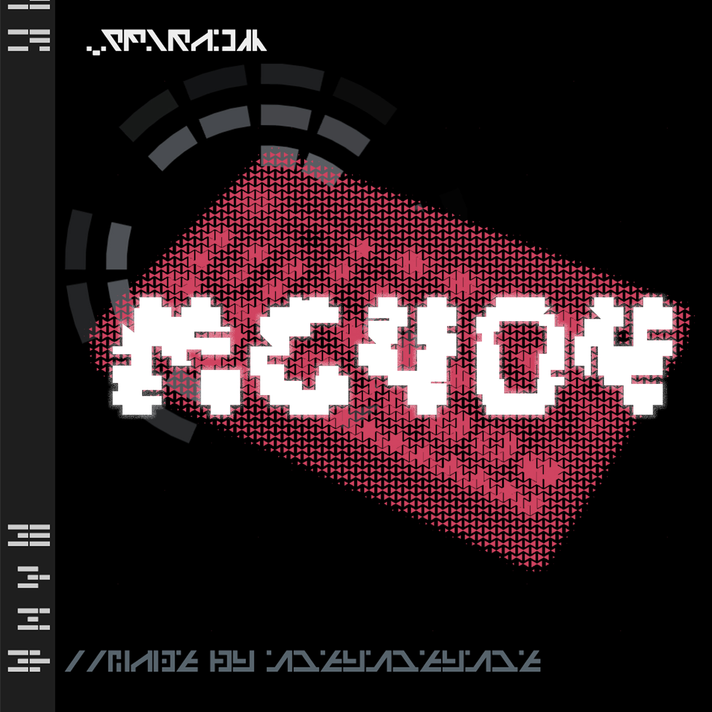

# mc404 sample pack
A collection of FM synthesis samples.



## Format
WAV files, 16-bit, 44.1kHz

## To use in [strudel.cc](strudel.cc)

The `strudel.json` has already been generated, so the sample pack can be easily loaded into strudel.
```
samples('github:zhouyuyang-joey/mc404')
```

## TODO
- add more (melodic) synth sound
- add some long samples and loops
- better ``oh`` sound (now it's almost identical to ``cr``!)

## License
**License:** [CC0 1.0 Universal](https://creativecommons.org/publicdomain/zero/1.0/deed.en)

### You CAN:
- Use these sounds in your music (commercial or non-commercial).
- Use them in your projects: games, videos, software etc.
- Modify them however you like.
- No attribution required.

### Please DON'T:
- **Don't resell this sample pack. (it's not cool and I'll hate you).**
